# BMAD + SpecKit + Ralph-Loop: Brownfield Discovery Addendum

**Document ID**: ARCH-2026-001-B  
**Version**: 1.0  
**Date**: 2026-01-25  
**Author**: Enzo Spenuso  
**Status**: Draft  
**Parent Document**: ARCH-2026-001 (Integration Blueprint)

---

## Executive Summary

Questo addendum estende il blueprint di integrazione BMAD-SpecKit-RalphLoop per supportare progetti **brownfield**, dove i requisiti, l'architettura e le specifiche devono essere **derivati automaticamente** dall'analisi di una codebase esistente. Il processo di "Reverse Discovery" sostituisce la fase di ideazione manuale con una scansione granulare e sistematica di tutti gli artefatti presenti nel repository, generando automaticamente gli input necessari per il flusso BMAD.

L'approccio proposto utilizza un **Discovery Agent** che orchestra multiple analisi specializzate: code analysis, database schema extraction, configuration parsing, dependency mapping, API discovery, e documentation synthesis. L'output è un **Discovered Project State (DPS)** che alimenta direttamente gli agenti BMAD per generare PRD e Architecture Documents allineati con la realtà esistente.

---

## Table of Contents

- [1. Brownfield Context](#1-brownfield-context)
- [2. Discovery Architecture](#2-discovery-architecture)
- [3. Scanner Components](#3-scanner-components)
- [4. Analysis Engines](#4-analysis-engines)
- [5. Discovered Project State (DPS)](#5-discovered-project-state-dps)
- [6. BMAD Integration for Brownfield](#6-bmad-integration-for-brownfield)
- [7. Workflow Modificato](#7-workflow-modificato)
- [8. Implementation Scripts](#8-implementation-scripts)
- [9. Pattern e Best Practices](#9-pattern-e-best-practices)
- [Appendici](#appendici)

---

## 1. Brownfield Context

### 1.1 Definizione del Problema

Nel contesto **greenfield** (blueprint principale), il flusso parte da un'IDEA umana:
```
IDEA (human) → BMAD Planning → SpecKit Specs → Ralph Execution
```

Nel contesto **brownfield**, l'IDEA deve essere **estratta** dalla codebase esistente:
```
CODEBASE (existing) → Discovery → Derived IDEA → BMAD Planning → SpecKit Specs → Ralph Execution
```

### 1.2 Sfide Specifiche Brownfield

| Sfida | Descrizione | Impatto |
|-------|-------------|---------|
| **Implicit Knowledge** | Requisiti non documentati ma implementati nel codice | PRD incompleto |
| **Technical Debt** | Pattern obsoleti, workaround, code smell | Architettura distorta |
| **Schema Evolution** | Database schema con migrazioni accumulate | Data model confuso |
| **Configuration Sprawl** | Config sparse tra file, env, secrets | Ambiente non riproducibile |
| **Undocumented APIs** | Endpoint senza spec OpenAPI/Swagger | Integration gaps |
| **Test Coverage Gaps** | Aree non testate = behavior non definito | Acceptance criteria mancanti |

### 1.3 Obiettivi del Discovery

1. **Completezza**: Scansionare TUTTO senza esclusioni
2. **Granularità**: Analisi a livello di file, funzione, schema
3. **Correlazione**: Collegare code ↔ db ↔ config ↔ docs
4. **Inferenza**: Derivare intent da implementation
5. **Prioritizzazione**: Identificare core vs peripheral features

---

## 2. Discovery Architecture

### 2.1 High-Level Architecture


### 2.2 Discovery Pipeline


### 2.3 Component Responsibilities

| Component | Input | Output | Purpose |
|-----------|-------|--------|---------|
| **Discovery Orchestrator** | Repo path | Coordination | Manages pipeline, aggregates results |
| **Code Scanner** | Source files | AST, metrics | Extract structure, patterns, complexity |
| **Database Scanner** | Connection/migrations | Schema DDL, relationships | Understand data model |
| **Config Scanner** | *.config, .env, yaml | Normalized config map | Environment understanding |
| **API Scanner** | Routes, controllers | OpenAPI-like spec | Interface discovery |
| **Dependency Scanner** | package.json, etc. | Dependency graph | Technology stack |
| **Architecture Analyzer** | All scan outputs | Architecture diagram | System structure |
| **Intent Inferrer** | Code + docs + tests | Feature descriptions | What it's supposed to do |
| **Gap Analyzer** | Tests vs code | Coverage gaps | Undefined behavior areas |

---

## 3. Scanner Components

### 3.1 Code Scanner

**Purpose**: Analisi statica del codice sorgente per estrarre struttura, pattern e metriche.

**Targets**:
```
src/
├── **/*.ts, *.tsx, *.js, *.jsx    # TypeScript/JavaScript
├── **/*.py                         # Python
├── **/*.java                       # Java
├── **/*.go                         # Go
├── **/*.rs                         # Rust
└── **/*                            # Any recognized language
```

**Extraction Points**:

| Aspect | What to Extract | How |
|--------|-----------------|-----|
| **Structure** | Modules, classes, functions | AST parsing |
| **Dependencies** | Imports, exports | Import analysis |
| **Patterns** | Design patterns used | Pattern matching |
| **Complexity** | Cyclomatic complexity | Static analysis |
| **Comments** | JSDoc, docstrings | Comment extraction |
| **Types** | Interfaces, types | Type extraction |
| **Routes** | Express routes, Next.js pages | Framework-specific |

**Output Schema**:
```typescript
interface CodeScanResult {
  files: FileScan[];
  modules: ModuleMap;
  patterns: DetectedPattern[];
  metrics: CodeMetrics;
  exports: ExportMap;
  routes: RouteDefinition[];
}

interface FileScan {
  path: string;
  language: string;
  loc: number;
  complexity: number;
  classes: ClassDef[];
  functions: FunctionDef[];
  imports: Import[];
  exports: Export[];
  comments: Comment[];
}
```

### 3.2 Database Scanner

**Purpose**: Estrazione completa dello schema database incluse relazioni, indici, e constraints.

**Methods**:
1. **Direct Connection**: Query information_schema
2. **Migration Files**: Parse migration history
3. **ORM Models**: Extract from Prisma/Sequelize/TypeORM

**PostgreSQL Extraction Queries**:

```sql
-- Tables and columns
SELECT 
    t.table_name,
    c.column_name,
    c.data_type,
    c.is_nullable,
    c.column_default,
    c.character_maximum_length
FROM information_schema.tables t
JOIN information_schema.columns c ON t.table_name = c.table_name
WHERE t.table_schema = 'public'
ORDER BY t.table_name, c.ordinal_position;

-- Foreign keys
SELECT
    tc.table_name,
    kcu.column_name,
    ccu.table_name AS foreign_table_name,
    ccu.column_name AS foreign_column_name
FROM information_schema.table_constraints AS tc
JOIN information_schema.key_column_usage AS kcu
    ON tc.constraint_name = kcu.constraint_name
JOIN information_schema.constraint_column_usage AS ccu
    ON ccu.constraint_name = tc.constraint_name
WHERE tc.constraint_type = 'FOREIGN KEY';

-- Indexes
SELECT
    tablename,
    indexname,
    indexdef
FROM pg_indexes
WHERE schemaname = 'public';

-- Enums
SELECT 
    t.typname AS enum_name,
    e.enumlabel AS enum_value
FROM pg_type t
JOIN pg_enum e ON t.oid = e.enumtypid
ORDER BY t.typname, e.enumsortorder;

-- Functions/Procedures
SELECT 
    routine_name,
    routine_type,
    data_type AS return_type
FROM information_schema.routines
WHERE routine_schema = 'public';

-- Triggers
SELECT 
    trigger_name,
    event_manipulation,
    event_object_table,
    action_statement
FROM information_schema.triggers
WHERE trigger_schema = 'public';
```

**Output Schema**:
```typescript
interface DatabaseScanResult {
  dialect: 'postgresql' | 'mysql' | 'sqlite' | 'mongodb';
  version: string;
  schemas: SchemaDefinition[];
  tables: TableDefinition[];
  relationships: Relationship[];
  indexes: IndexDefinition[];
  enums: EnumDefinition[];
  functions: FunctionDefinition[];
  triggers: TriggerDefinition[];
  migrations: MigrationHistory[];
}

interface TableDefinition {
  name: string;
  schema: string;
  columns: ColumnDefinition[];
  primaryKey: string[];
  foreignKeys: ForeignKey[];
  indexes: string[];
  rowCount?: number;
  estimatedSize?: string;
}
```

### 3.3 Configuration Scanner

**Purpose**: Raccolta e normalizzazione di tutte le configurazioni di progetto.

**Target Files**:
```
project/
├── .env, .env.*                    # Environment variables
├── package.json                    # Node.js config
├── tsconfig.json                   # TypeScript config
├── next.config.js                  # Next.js config
├── prisma/schema.prisma            # Prisma schema
├── docker-compose.yml              # Docker config
├── Dockerfile                      # Container definition
├── .github/workflows/*.yml         # CI/CD pipelines
├── nginx.conf, apache.conf         # Web server config
├── pm2.config.js                   # Process manager
├── jest.config.js                  # Test config
├── eslint.config.js                # Linter config
├── .prettierrc                     # Formatter config
└── **/*.config.{js,ts,json,yaml}   # Any config file
```

**Extraction Strategy**:

```typescript
interface ConfigScanResult {
  environment: {
    development: EnvVars;
    staging: EnvVars;
    production: EnvVars;
    required: string[];      // Vars that must be set
    secrets: string[];       // Vars that are sensitive
  };
  runtime: {
    node: NodeConfig;
    typescript: TSConfig;
    framework: FrameworkConfig;
  };
  infrastructure: {
    docker: DockerConfig;
    cicd: CICDConfig;
    deployment: DeploymentConfig;
  };
  development: {
    linting: LintConfig;
    testing: TestConfig;
    formatting: FormatConfig;
  };
}
```

### 3.4 API Scanner

**Purpose**: Scoperta automatica di tutti gli endpoint API esposti.

**Discovery Methods**:

1. **Express/Fastify Route Scanning**:
```typescript
// Pattern matching for route definitions
const routePatterns = [
  /app\.(get|post|put|patch|delete|all)\s*\(\s*['"`]([^'"`]+)['"`]/g,
  /router\.(get|post|put|patch|delete|all)\s*\(\s*['"`]([^'"`]+)['"`]/g,
];
```

2. **Next.js API Routes**:
```
pages/api/**/*.ts → /api/*
app/api/**/route.ts → /api/*
```

3. **OpenAPI/Swagger Extraction**:
```typescript
// If swagger.json or openapi.yaml exists
const spec = await SwaggerParser.parse('swagger.json');
```

4. **Runtime Discovery** (optional):
```bash
# Intercept HTTP during test run
npm test -- --detectOpenHandles 2>&1 | grep -E "GET|POST|PUT|DELETE"
```

**Output Schema**:
```typescript
interface APIScanResult {
  baseUrl: string;
  version: string;
  authentication: AuthMethod[];
  endpoints: EndpointDefinition[];
  schemas: JSONSchema[];
  errors: ErrorDefinition[];
}

interface EndpointDefinition {
  method: HttpMethod;
  path: string;
  summary?: string;
  description?: string;
  parameters: Parameter[];
  requestBody?: RequestBody;
  responses: ResponseDefinition[];
  middleware: string[];
  authentication: boolean;
  authorization?: string[];
  rateLimit?: RateLimitConfig;
  sourceFile: string;
  sourceLine: number;
}
```

### 3.5 Dependency Scanner

**Purpose**: Mappa completa delle dipendenze e del technology stack.

**Sources**:
```
package.json          → npm dependencies
package-lock.json     → locked versions
requirements.txt      → Python deps
Pipfile               → Python deps (pipenv)
go.mod                → Go modules
Cargo.toml            → Rust crates
pom.xml               → Java Maven
build.gradle          → Java Gradle
```

**Analysis**:
```typescript
interface DependencyScanResult {
  packageManager: 'npm' | 'yarn' | 'pnpm' | 'pip' | 'cargo' | 'go';
  
  dependencies: {
    production: Dependency[];
    development: Dependency[];
    peer: Dependency[];
    optional: Dependency[];
  };
  
  stack: {
    runtime: string;           // e.g., "Node.js 20.x"
    framework: string;         // e.g., "Next.js 14"
    database: string;          // e.g., "PostgreSQL 15"
    orm: string;               // e.g., "Prisma 5.x"
    testing: string[];         // e.g., ["Jest", "Playwright"]
    deployment: string[];      // e.g., ["Docker", "PM2"]
  };
  
  security: {
    vulnerabilities: Vulnerability[];
    outdated: OutdatedPackage[];
    deprecated: DeprecatedPackage[];
  };
  
  licenses: LicenseInfo[];
}
```

### 3.6 Documentation Scanner

**Purpose**: Estrazione di tutta la documentazione esistente.

**Sources**:
```
README.md
docs/**/*.md
CONTRIBUTING.md
CHANGELOG.md
API.md
*.md (any markdown)
JSDoc comments in code
OpenAPI/Swagger specs
Postman collections
```

**Output**:
```typescript
interface DocsScanResult {
  readme: ParsedMarkdown;
  architecture: ParsedMarkdown[];
  api: APIDocumentation[];
  guides: Guide[];
  changelog: ChangelogEntry[];
  inline: InlineDocumentation[];
  coverage: {
    documented: string[];      // Files/functions with docs
    undocumented: string[];    // Files/functions without docs
    percentage: number;
  };
}
```

### 3.7 Test Scanner

**Purpose**: Analisi della test suite per comprendere behavior specification.

**Sources**:
```
__tests__/**/*
*.test.ts, *.spec.ts
*.test.js, *.spec.js
test/**/*
e2e/**/*
cypress/**/*
playwright/**/*
```

**Extraction**:
```typescript
interface TestScanResult {
  framework: 'jest' | 'mocha' | 'vitest' | 'playwright' | 'cypress';
  
  suites: TestSuite[];
  
  coverage: {
    lines: number;
    branches: number;
    functions: number;
    statements: number;
    uncovered: UncoveredArea[];
  };
  
  patterns: {
    unit: number;
    integration: number;
    e2e: number;
  };
  
  assertions: {
    total: number;
    byType: Record<string, number>;
  };
}

interface TestSuite {
  file: string;
  name: string;
  tests: TestCase[];
  setup: string[];
  teardown: string[];
}

interface TestCase {
  name: string;
  description: string;      // Derived from test name
  assertions: Assertion[];
  mocks: string[];
  fixtures: string[];
  // This becomes acceptance criteria!
  impliedBehavior: string;
}
```

---

## 4. Analysis Engines

### 4.1 Architecture Analyzer

**Purpose**: Inferire l'architettura del sistema dai risultati degli scanner.


**Layer Detection Heuristics**:

| Layer | Detection Pattern |
|-------|-------------------|
| **Presentation** | `pages/`, `components/`, `views/`, React/Vue/Angular |
| **API/Controller** | `routes/`, `controllers/`, `api/`, Express handlers |
| **Service/Business** | `services/`, `usecases/`, `domain/` |
| **Data Access** | `repositories/`, `models/`, ORM usage |
| **Infrastructure** | `config/`, `middleware/`, `utils/` |

**Output**:
```typescript
interface ArchitectureAnalysis {
  pattern: 'monolith' | 'microservices' | 'modular-monolith' | 'serverless';
  
  layers: {
    presentation: Component[];
    application: Component[];
    domain: Component[];
    infrastructure: Component[];
  };
  
  boundaries: {
    modules: ModuleBoundary[];
    services: ServiceBoundary[];
    contexts: BoundedContext[];  // DDD contexts if detectable
  };
  
  dataFlow: DataFlowDiagram;
  
  integrations: {
    internal: InternalIntegration[];
    external: ExternalIntegration[];
  };
  
  mermaidDiagram: string;  // Generated Mermaid code
}
```

### 4.2 Intent Inferrer

**Purpose**: Derivare il "cosa dovrebbe fare" dal "cosa fa effettivamente".

**Inference Sources**:

1. **Test Names** → Feature descriptions
   ```
   "should create user with valid email" → User Registration Feature
   ```

2. **Route Paths** → User journeys
   ```
   POST /api/auth/login → Authentication Flow
   GET /api/users/:id → User Profile Access
   ```

3. **Database Tables** → Domain entities
   ```
   employees, departments, positions → HR Domain
   ```

4. **Component Names** → UI Features
   ```
   LoginForm, Dashboard, EmployeeList → User Interface Features
   ```

5. **Comments/Docs** → Explicit intent

**Output**:
```typescript
interface IntentAnalysis {
  domains: DomainDefinition[];
  features: InferredFeature[];
  userJourneys: UserJourney[];
  businessRules: BusinessRule[];
  
  confidence: {
    overall: number;  // 0-100
    byFeature: Record<string, number>;
  };
}

interface InferredFeature {
  name: string;
  description: string;
  inferredFrom: InferenceSource[];
  relatedCode: string[];
  relatedTests: string[];
  relatedEndpoints: string[];
  confidence: number;
}
```

### 4.3 Gap Analyzer

**Purpose**: Identificare aree con behavior non definito o non testato.

**Gap Types**:

| Gap Type | Detection Method | Impact |
|----------|-----------------|--------|
| **Test Gap** | Coverage < threshold | Undefined behavior |
| **Doc Gap** | No comments/docs | Unknown intent |
| **Type Gap** | `any`, missing types | Runtime risks |
| **Error Gap** | No error handling | Failure modes unknown |
| **Auth Gap** | Unprotected endpoints | Security risk |
| **Validation Gap** | No input validation | Data integrity risk |

**Output**:
```typescript
interface GapAnalysis {
  testGaps: {
    uncoveredFiles: string[];
    uncoveredFunctions: string[];
    lowCoverageAreas: CoverageArea[];
  };
  
  documentationGaps: {
    undocumentedPublicAPIs: string[];
    missingReadme: boolean;
    outdatedDocs: string[];
  };
  
  securityGaps: {
    unprotectedEndpoints: string[];
    missingValidation: string[];
    hardcodedSecrets: string[];
  };
  
  technicalDebt: {
    codeSmells: CodeSmell[];
    complexity: ComplexityIssue[];
    duplication: DuplicationIssue[];
  };
  
  recommendations: Recommendation[];
}
```

---

## 5. Discovered Project State (DPS)

### 5.1 DPS Document Structure

Il **Discovered Project State (DPS)** è l'output principale del processo di discovery. È un documento strutturato che cattura tutto ciò che è stato scoperto e inferito.

```yaml
# discovered-project-state.yaml

metadata:
  discovery_date: "2026-01-25T10:00:00Z"
  discovery_version: "1.0"
  repository: "/path/to/heuresys.com.evo"
  commit: "abc123def"
  confidence_score: 85

project:
  name: "Heuresys AI-Platform"  # Inferred or from package.json
  description: "AI-augmented HRMS system"
  version: "0.1.0"
  
technology_stack:
  runtime:
    name: "Node.js"
    version: "20.x"
  framework:
    name: "Express + Next.js"
    versions:
      express: "4.18.x"
      next: "14.x"
  database:
    type: "PostgreSQL"
    version: "15"
    orm: "Prisma"
  frontend:
    framework: "React"
    styling: "Tailwind CSS"
  testing:
    unit: "Jest"
    e2e: "Playwright"
  deployment:
    containerization: "Docker"
    orchestration: "Docker Compose"
    hosting: "Oracle Cloud VM"

architecture:
  pattern: "modular-monolith"
  layers:
    presentation:
      - name: "Next.js Frontend"
        path: "src/frontend/"
        components: 45
    api:
      - name: "Express API"
        path: "src/backend/routes/"
        endpoints: 32
    services:
      - name: "Business Services"
        path: "src/backend/services/"
        modules: 12
    data:
      - name: "Prisma Data Layer"
        path: "src/backend/repositories/"
        entities: 18
  
  diagram: |
    graph TB
      subgraph "Presentation"
        NEXT[Next.js App]
      end
      subgraph "API Layer"
        EXPRESS[Express API]
      end
      subgraph "Services"
        AUTH[Auth Service]
        HR[HR Service]
        AI[AI Service]
      end
      subgraph "Data"
        PRISMA[Prisma ORM]
        PG[(PostgreSQL)]
        QDRANT[(Qdrant)]
      end
      NEXT --> EXPRESS
      EXPRESS --> AUTH
      EXPRESS --> HR
      EXPRESS --> AI
      AUTH --> PRISMA
      HR --> PRISMA
      AI --> QDRANT
      PRISMA --> PG

domains:
  - name: "Authentication & Authorization"
    entities: ["User", "Role", "Permission", "Session"]
    features:
      - "User registration"
      - "Login/logout"
      - "Role-based access control"
      - "Session management"
    endpoints: ["/api/auth/*"]
    confidence: 95
    
  - name: "Employee Management"
    entities: ["Employee", "Department", "Position", "Contract"]
    features:
      - "Employee CRUD"
      - "Department hierarchy"
      - "Position assignment"
      - "Contract management"
    endpoints: ["/api/employees/*", "/api/departments/*"]
    confidence: 90
    
  - name: "AI Assistant"
    entities: ["Conversation", "Message", "Document", "Embedding"]
    features:
      - "HR policy Q&A"
      - "Document search"
      - "Context-aware responses"
    endpoints: ["/api/ai/*"]
    confidence: 75

database_schema:
  tables:
    - name: "users"
      columns: 12
      relationships: ["roles", "employees"]
      estimated_rows: "10K"
    - name: "employees"
      columns: 25
      relationships: ["departments", "positions", "contracts"]
      estimated_rows: "5K"
    # ... all tables
  
  relationships:
    - from: "employees"
      to: "departments"
      type: "many-to-one"
    # ... all relationships

api_surface:
  total_endpoints: 32
  by_domain:
    auth: 8
    employees: 12
    departments: 5
    ai: 7
  authentication: "JWT"
  versioning: "none"
  documentation: "partial"  # OpenAPI exists but incomplete

test_coverage:
  overall: 67
  unit: 78
  integration: 45
  e2e: 23
  uncovered_areas:
    - "src/backend/services/ai/"
    - "src/frontend/components/reports/"

gaps_and_debt:
  critical:
    - type: "security"
      description: "Missing rate limiting on auth endpoints"
      location: "src/backend/routes/auth.ts"
    - type: "test"
      description: "AI service has 0% test coverage"
      location: "src/backend/services/ai/"
  
  high:
    - type: "documentation"
      description: "No API documentation for employee endpoints"
    - type: "validation"
      description: "Missing input validation on 5 endpoints"
  
  medium:
    - type: "code_smell"
      description: "God class in HRService"
      location: "src/backend/services/HRService.ts"
      lines: 1200

inferred_requirements:
  functional:
    - id: "FR-001"
      description: "System shall allow users to register with email and password"
      source: "test: 'should create user with valid email'"
      confidence: 95
    - id: "FR-002"
      description: "System shall authenticate users via JWT tokens"
      source: "code: AuthService.generateToken()"
      confidence: 100
    # ... more FRs
      
  non_functional:
    - id: "NFR-001"
      category: "Performance"
      description: "API responses under 200ms"
      source: "test: 'should respond within 200ms'"
      confidence: 80
    # ... more NFRs

recommendations:
  immediate:
    - "Add rate limiting to authentication endpoints"
    - "Increase test coverage for AI service"
  short_term:
    - "Complete API documentation"
    - "Refactor HRService into smaller services"
  long_term:
    - "Consider microservices extraction for AI domain"
    - "Implement comprehensive monitoring"
```

### 5.2 DPS to BMAD Mapping

| DPS Section | BMAD Document | Target Section |
|-------------|---------------|----------------|
| `project.*` | Project Brief | Overview |
| `technology_stack` | Architecture | Tech Stack |
| `domains[].features` | PRD | Functional Requirements |
| `inferred_requirements.functional` | PRD | Detailed FRs |
| `inferred_requirements.non_functional` | PRD | NFRs |
| `architecture.diagram` | Architecture | System Overview |
| `database_schema` | Architecture | Data Model |
| `api_surface` | Architecture | API Specification |
| `gaps_and_debt` | PRD / Tech Spec | Technical Debt section |
| `recommendations` | PRD | Roadmap |

---

## 6. BMAD Integration for Brownfield

### 6.1 Modified BMAD Workflow

Nel contesto brownfield, gli agenti BMAD ricevono il DPS come input invece dell'idea umana.


### 6.2 Brownfield-Specific BMAD Commands

```bash
# New command: Discover and document existing project
/discover-project [path]

# Runs full discovery pipeline
# Generates: docs/discovered-project-state.yaml

# Modified command: Document project from DPS
/document-project

# Analyst agent reads DPS and generates aligned Project Brief
# PM agent generates PRD aligned with existing system
# Architect agent validates/updates architecture based on DPS

# New command: Gap analysis to planning
/plan-improvements

# Takes DPS gaps_and_debt section
# Generates improvement PRD with prioritized stories
```

### 6.3 BMAD Agent Modifications for Brownfield

**Analyst Agent - Brownfield Mode**:
```markdown
# Analyst Agent - Brownfield Mode

## Context
You are analyzing an EXISTING project, not creating a new one.

## Inputs
- Discovered Project State (DPS) document
- Existing codebase (read-only analysis)

## Objectives
1. VALIDATE DPS accuracy against codebase
2. IDENTIFY gaps in DPS coverage
3. CLARIFY ambiguous inferred requirements
4. GENERATE Project Brief that describes CURRENT state

## Constraints
- Do NOT invent features not present in code
- Do NOT assume intent without evidence
- DO highlight areas of uncertainty
- DO preserve existing naming conventions

## Output
- Validated Project Brief (docs/project-brief.md)
- Confidence annotations on all inferred items
```

**PM Agent - Brownfield Mode**:
```markdown
# PM Agent - Brownfield Mode

## Context
You are documenting an EXISTING system's requirements.

## Inputs
- Discovered Project State (DPS)
- Validated Project Brief
- Existing test suite (as behavior specification)

## Objectives
1. DOCUMENT current functional requirements (not design new ones)
2. EXTRACT acceptance criteria from existing tests
3. IDENTIFY undocumented business rules in code
4. HIGHLIGHT gaps requiring clarification

## PRD Sections for Brownfield
1. Current State Summary
2. Documented Features (from DPS)
3. Inferred Features (from code analysis)
4. Technical Debt and Gaps
5. Proposed Improvements (if requested)

## Output
- PRD that accurately reflects EXISTING system
- Clear separation: [DOCUMENTED] vs [INFERRED] vs [GAP]
```

### 6.4 Brownfield-Specific SpecKit Integration

Per brownfield, SpecKit constitution include vincoli dell'esistente:

**constitution.md** (Brownfield):
```markdown
# Project Constitution - Brownfield

## Existing System Constraints

### Technology Stack (IMMUTABLE)
The following stack is established and must be maintained:
- Runtime: Node.js 20.x
- Backend: Express 4.x
- Frontend: Next.js 14.x
- Database: PostgreSQL 15
- ORM: Prisma 5.x

### Architectural Patterns (ESTABLISHED)
- Modular monolith structure
- Service-oriented backend
- REST API conventions
- JWT authentication

### Code Conventions (EXISTING)
- TypeScript strict mode
- ESLint + Prettier configuration
- Jest for unit tests
- Existing folder structure must be preserved

## Improvement Boundaries

### Can Change
- Add new features following existing patterns
- Refactor within existing architecture
- Improve test coverage
- Add documentation

### Cannot Change Without Review
- Core authentication mechanism
- Database schema (requires migration plan)
- API versioning strategy
- Deployment infrastructure

### Requires Explicit Approval
- Breaking changes to public APIs
- Database migrations affecting production
- New external dependencies
- Security-related changes
```

---

## 7. Workflow Modificato

### 7.1 Complete Brownfield Workflow


### 7.2 Discovery Command Detail

```bash
#!/bin/bash
# /discover-project implementation

PROJECT_PATH=${1:-.}
OUTPUT_DIR="$PROJECT_PATH/docs/discovery"

echo "🔍 Starting project discovery for: $PROJECT_PATH"

# Create output directory
mkdir -p "$OUTPUT_DIR"

# Phase 1: Parallel Scanning
echo "📁 Phase 1: Scanning..."

# Code scan
echo "  → Scanning source code..."
node scripts/scanners/code-scanner.js "$PROJECT_PATH" > "$OUTPUT_DIR/code-scan.json" &

# Database scan
echo "  → Extracting database schema..."
node scripts/scanners/db-scanner.js "$PROJECT_PATH" > "$OUTPUT_DIR/db-scan.json" &

# Config scan
echo "  → Parsing configurations..."
node scripts/scanners/config-scanner.js "$PROJECT_PATH" > "$OUTPUT_DIR/config-scan.json" &

# API scan
echo "  → Discovering API endpoints..."
node scripts/scanners/api-scanner.js "$PROJECT_PATH" > "$OUTPUT_DIR/api-scan.json" &

# Dependency scan
echo "  → Mapping dependencies..."
node scripts/scanners/deps-scanner.js "$PROJECT_PATH" > "$OUTPUT_DIR/deps-scan.json" &

# Test scan
echo "  → Analyzing test suite..."
node scripts/scanners/test-scanner.js "$PROJECT_PATH" > "$OUTPUT_DIR/test-scan.json" &

# Wait for all scans
wait

echo "✅ Scanning complete"

# Phase 2: Analysis
echo "🧠 Phase 2: Analyzing..."

node scripts/analyzers/architecture-analyzer.js "$OUTPUT_DIR" > "$OUTPUT_DIR/architecture-analysis.json"
node scripts/analyzers/intent-inferrer.js "$OUTPUT_DIR" > "$OUTPUT_DIR/intent-analysis.json"
node scripts/analyzers/gap-analyzer.js "$OUTPUT_DIR" > "$OUTPUT_DIR/gap-analysis.json"

echo "✅ Analysis complete"

# Phase 3: Synthesis
echo "📝 Phase 3: Synthesizing DPS..."

node scripts/synthesize-dps.js "$OUTPUT_DIR" > "$PROJECT_PATH/docs/discovered-project-state.yaml"

echo "✅ Discovery complete!"
echo "📄 Output: docs/discovered-project-state.yaml"
```

### 7.3 Workflow State Machine (Brownfield)


---

## 8. Implementation Scripts

### 8.1 Code Scanner (Node.js)

```typescript
// scripts/scanners/code-scanner.ts

import * as fs from 'fs';
import * as path from 'path';
import * as parser from '@babel/parser';
import traverse from '@babel/traverse';
import { glob } from 'glob';

interface CodeScanResult {
  files: FileScan[];
  summary: {
    totalFiles: number;
    totalLOC: number;
    languages: Record<string, number>;
    frameworks: string[];
  };
}

interface FileScan {
  path: string;
  language: string;
  loc: number;
  imports: string[];
  exports: string[];
  functions: FunctionDef[];
  classes: ClassDef[];
  routes?: RouteDef[];
}

async function scanCodebase(projectPath: string): Promise<CodeScanResult> {
  const files: FileScan[] = [];
  
  // Find all source files
  const sourceFiles = await glob('**/*.{ts,tsx,js,jsx}', {
    cwd: projectPath,
    ignore: ['node_modules/**', 'dist/**', '.next/**', 'coverage/**']
  });
  
  for (const file of sourceFiles) {
    const filePath = path.join(projectPath, file);
    const content = fs.readFileSync(filePath, 'utf-8');
    
    const scan = await scanFile(filePath, content);
    files.push(scan);
  }
  
  return {
    files,
    summary: generateSummary(files)
  };
}

async function scanFile(filePath: string, content: string): Promise<FileScan> {
  const ext = path.extname(filePath);
  const isTypeScript = ext === '.ts' || ext === '.tsx';
  
  const ast = parser.parse(content, {
    sourceType: 'module',
    plugins: isTypeScript 
      ? ['typescript', 'jsx', 'decorators-legacy']
      : ['jsx']
  });
  
  const imports: string[] = [];
  const exports: string[] = [];
  const functions: FunctionDef[] = [];
  const classes: ClassDef[] = [];
  const routes: RouteDef[] = [];
  
  traverse(ast, {
    ImportDeclaration(path) {
      imports.push(path.node.source.value);
    },
    
    ExportNamedDeclaration(path) {
      if (path.node.declaration) {
        // Extract export name
      }
    },
    
    FunctionDeclaration(path) {
      functions.push({
        name: path.node.id?.name || 'anonymous',
        params: path.node.params.length,
        async: path.node.async,
        loc: path.node.loc?.start.line || 0
      });
    },
    
    ClassDeclaration(path) {
      classes.push({
        name: path.node.id?.name || 'anonymous',
        methods: [],  // Extract methods
        loc: path.node.loc?.start.line || 0
      });
    },
    
    // Express route detection
    CallExpression(path) {
      if (isExpressRoute(path)) {
        routes.push(extractRoute(path));
      }
    }
  });
  
  return {
    path: filePath,
    language: isTypeScript ? 'typescript' : 'javascript',
    loc: content.split('\n').length,
    imports,
    exports,
    functions,
    classes,
    routes: routes.length > 0 ? routes : undefined
  };
}

function isExpressRoute(path: any): boolean {
  const callee = path.node.callee;
  if (callee.type === 'MemberExpression') {
    const method = callee.property.name;
    return ['get', 'post', 'put', 'patch', 'delete', 'all'].includes(method);
  }
  return false;
}

// Main execution
const projectPath = process.argv[2] || '.';
scanCodebase(projectPath)
  .then(result => console.log(JSON.stringify(result, null, 2)))
  .catch(console.error);
```

### 8.2 Database Scanner (PostgreSQL)

```typescript
// scripts/scanners/db-scanner.ts

import { Client } from 'pg';
import * as fs from 'fs';
import * as path from 'path';

interface DBScanResult {
  dialect: string;
  version: string;
  tables: TableDef[];
  relationships: Relationship[];
  indexes: IndexDef[];
  enums: EnumDef[];
}

async function scanDatabase(projectPath: string): Promise<DBScanResult> {
  // Try to get connection from .env or prisma schema
  const connectionString = await getConnectionString(projectPath);
  
  const client = new Client({ connectionString });
  await client.connect();
  
  try {
    const version = await getVersion(client);
    const tables = await getTables(client);
    const relationships = await getRelationships(client);
    const indexes = await getIndexes(client);
    const enums = await getEnums(client);
    
    return {
      dialect: 'postgresql',
      version,
      tables,
      relationships,
      indexes,
      enums
    };
  } finally {
    await client.end();
  }
}

async function getTables(client: Client): Promise<TableDef[]> {
  const result = await client.query(`
    SELECT 
      t.table_name,
      json_agg(json_build_object(
        'name', c.column_name,
        'type', c.data_type,
        'nullable', c.is_nullable,
        'default', c.column_default,
        'maxLength', c.character_maximum_length
      ) ORDER BY c.ordinal_position) as columns
    FROM information_schema.tables t
    JOIN information_schema.columns c 
      ON t.table_name = c.table_name 
      AND t.table_schema = c.table_schema
    WHERE t.table_schema = 'public'
      AND t.table_type = 'BASE TABLE'
    GROUP BY t.table_name
    ORDER BY t.table_name
  `);
  
  return result.rows.map(row => ({
    name: row.table_name,
    columns: row.columns
  }));
}

async function getRelationships(client: Client): Promise<Relationship[]> {
  const result = await client.query(`
    SELECT
      tc.table_name as from_table,
      kcu.column_name as from_column,
      ccu.table_name AS to_table,
      ccu.column_name AS to_column
    FROM information_schema.table_constraints AS tc
    JOIN information_schema.key_column_usage AS kcu
      ON tc.constraint_name = kcu.constraint_name
    JOIN information_schema.constraint_column_usage AS ccu
      ON ccu.constraint_name = tc.constraint_name
    WHERE tc.constraint_type = 'FOREIGN KEY'
  `);
  
  return result.rows.map(row => ({
    from: { table: row.from_table, column: row.from_column },
    to: { table: row.to_table, column: row.to_column },
    type: 'foreign_key'
  }));
}

async function getConnectionString(projectPath: string): Promise<string> {
  // Try .env file
  const envPath = path.join(projectPath, '.env');
  if (fs.existsSync(envPath)) {
    const envContent = fs.readFileSync(envPath, 'utf-8');
    const match = envContent.match(/DATABASE_URL=["']?([^"'\n]+)/);
    if (match) return match[1];
  }
  
  // Try prisma schema
  const prismaPath = path.join(projectPath, 'prisma', 'schema.prisma');
  if (fs.existsSync(prismaPath)) {
    const prismaContent = fs.readFileSync(prismaPath, 'utf-8');
    const match = prismaContent.match(/url\s*=\s*env\("([^"]+)"\)/);
    if (match) {
      return process.env[match[1]] || '';
    }
  }
  
  throw new Error('Could not find database connection string');
}

// Main
const projectPath = process.argv[2] || '.';
scanDatabase(projectPath)
  .then(result => console.log(JSON.stringify(result, null, 2)))
  .catch(console.error);
```

### 8.3 DPS Synthesizer

```typescript
// scripts/synthesize-dps.ts

import * as fs from 'fs';
import * as path from 'path';
import * as yaml from 'yaml';

interface ScanResults {
  code: any;
  db: any;
  config: any;
  api: any;
  deps: any;
  tests: any;
  architecture: any;
  intent: any;
  gaps: any;
}

async function synthesizeDPS(discoveryDir: string): Promise<string> {
  // Load all scan results
  const scans: ScanResults = {
    code: loadJSON(path.join(discoveryDir, 'code-scan.json')),
    db: loadJSON(path.join(discoveryDir, 'db-scan.json')),
    config: loadJSON(path.join(discoveryDir, 'config-scan.json')),
    api: loadJSON(path.join(discoveryDir, 'api-scan.json')),
    deps: loadJSON(path.join(discoveryDir, 'deps-scan.json')),
    tests: loadJSON(path.join(discoveryDir, 'test-scan.json')),
    architecture: loadJSON(path.join(discoveryDir, 'architecture-analysis.json')),
    intent: loadJSON(path.join(discoveryDir, 'intent-analysis.json')),
    gaps: loadJSON(path.join(discoveryDir, 'gap-analysis.json'))
  };
  
  // Synthesize DPS
  const dps = {
    metadata: {
      discovery_date: new Date().toISOString(),
      discovery_version: '1.0',
      confidence_score: calculateConfidence(scans)
    },
    
    project: inferProjectInfo(scans),
    
    technology_stack: {
      runtime: inferRuntime(scans.deps, scans.config),
      framework: inferFramework(scans.deps, scans.code),
      database: inferDatabase(scans.db, scans.config),
      frontend: inferFrontend(scans.deps, scans.code),
      testing: inferTestingStack(scans.deps, scans.tests),
      deployment: inferDeployment(scans.config)
    },
    
    architecture: scans.architecture,
    
    domains: inferDomains(scans),
    
    database_schema: {
      tables: scans.db.tables,
      relationships: scans.db.relationships,
      indexes: scans.db.indexes,
      enums: scans.db.enums
    },
    
    api_surface: {
      total_endpoints: scans.api.endpoints?.length || 0,
      endpoints: scans.api.endpoints,
      authentication: inferAuthMethod(scans.code, scans.config)
    },
    
    test_coverage: scans.tests.coverage,
    
    gaps_and_debt: categorizeGaps(scans.gaps),
    
    inferred_requirements: {
      functional: inferFunctionalRequirements(scans),
      non_functional: inferNonFunctionalRequirements(scans)
    },
    
    recommendations: generateRecommendations(scans)
  };
  
  return yaml.stringify(dps);
}

function inferProjectInfo(scans: ScanResults): any {
  // Try package.json first
  if (scans.deps?.packageJson) {
    return {
      name: scans.deps.packageJson.name,
      description: scans.deps.packageJson.description,
      version: scans.deps.packageJson.version
    };
  }
  
  // Infer from code structure
  return {
    name: 'Unknown Project',
    description: 'Inferred from codebase analysis',
    version: '0.0.0'
  };
}

function inferDomains(scans: ScanResults): any[] {
  const domains: any[] = [];
  
  // Group by folder structure
  const folders = new Map<string, any[]>();
  
  for (const file of scans.code.files || []) {
    const parts = file.path.split('/');
    const domain = parts[2] || parts[1]; // src/domain/ or domain/
    
    if (!folders.has(domain)) {
      folders.set(domain, []);
    }
    folders.get(domain)!.push(file);
  }
  
  // Create domain definitions
  for (const [name, files] of folders) {
    if (isValidDomain(name)) {
      domains.push({
        name: formatDomainName(name),
        files: files.length,
        entities: extractEntities(files, scans.db),
        features: inferFeatures(files, scans.tests, scans.intent),
        endpoints: findDomainEndpoints(name, scans.api),
        confidence: calculateDomainConfidence(files, scans)
      });
    }
  }
  
  return domains;
}

function inferFunctionalRequirements(scans: ScanResults): any[] {
  const requirements: any[] = [];
  let frId = 1;
  
  // From test descriptions
  for (const suite of scans.tests?.suites || []) {
    for (const test of suite.tests || []) {
      requirements.push({
        id: `FR-${String(frId++).padStart(3, '0')}`,
        description: testNameToRequirement(test.name),
        source: `test: '${test.name}'`,
        confidence: 90
      });
    }
  }
  
  // From API endpoints
  for (const endpoint of scans.api?.endpoints || []) {
    requirements.push({
      id: `FR-${String(frId++).padStart(3, '0')}`,
      description: endpointToRequirement(endpoint),
      source: `api: ${endpoint.method} ${endpoint.path}`,
      confidence: 85
    });
  }
  
  // From intent analysis
  for (const feature of scans.intent?.features || []) {
    requirements.push({
      id: `FR-${String(frId++).padStart(3, '0')}`,
      description: feature.description,
      source: `inferred: ${feature.inferredFrom.join(', ')}`,
      confidence: feature.confidence
    });
  }
  
  return requirements;
}

function testNameToRequirement(testName: string): string {
  // "should create user with valid email" 
  // → "System shall create user with valid email"
  return testName
    .replace(/^should\s+/, 'System shall ')
    .replace(/^it\s+/, 'System shall ')
    .replace(/^test\s+/, 'System shall ');
}

function endpointToRequirement(endpoint: any): string {
  const verb = {
    'GET': 'retrieve',
    'POST': 'create',
    'PUT': 'update',
    'PATCH': 'modify',
    'DELETE': 'delete'
  }[endpoint.method] || 'handle';
  
  const resource = endpoint.path
    .split('/')
    .filter((p: string) => p && !p.startsWith(':'))
    .pop() || 'resource';
  
  return `System shall ${verb} ${resource}`;
}

function loadJSON(filePath: string): any {
  try {
    return JSON.parse(fs.readFileSync(filePath, 'utf-8'));
  } catch {
    return {};
  }
}

// Main
const discoveryDir = process.argv[2];
synthesizeDPS(discoveryDir)
  .then(dps => console.log(dps))
  .catch(console.error);
```

### 8.4 Full Discovery Pipeline Script

```bash
#!/bin/bash
# scripts/discover-project.sh
# Complete brownfield discovery pipeline

set -e

PROJECT_PATH="${1:-.}"
PROJECT_PATH=$(realpath "$PROJECT_PATH")
OUTPUT_DIR="$PROJECT_PATH/docs/discovery"
SCRIPTS_DIR="$(dirname "$0")"

echo "╔══════════════════════════════════════════════════════════════╗"
echo "║          BMAD-SpecKit-Ralph Brownfield Discovery             ║"
echo "╚══════════════════════════════════════════════════════════════╝"
echo ""
echo "📁 Project: $PROJECT_PATH"
echo ""

# Create output directory
mkdir -p "$OUTPUT_DIR"

# Phase 1: Parallel Scanning
echo "━━━━━━━━━━━━━━━━━━━━━━━━━━━━━━━━━━━━━━━━━━━━━━━━━━━━━━━━━━━━━━"
echo "🔍 PHASE 1: Scanning Project"
echo "━━━━━━━━━━━━━━━━━━━━━━━━━━━━━━━━━━━━━━━━━━━━━━━━━━━━━━━━━━━━━━"

# Code scan
echo "  [1/7] Scanning source code..."
if command -v npx &> /dev/null; then
  npx ts-node "$SCRIPTS_DIR/scanners/code-scanner.ts" "$PROJECT_PATH" \
    > "$OUTPUT_DIR/code-scan.json" 2>/dev/null &
  CODE_PID=$!
else
  echo '{"error": "ts-node not available"}' > "$OUTPUT_DIR/code-scan.json" &
  CODE_PID=$!
fi

# Database scan
echo "  [2/7] Extracting database schema..."
npx ts-node "$SCRIPTS_DIR/scanners/db-scanner.ts" "$PROJECT_PATH" \
  > "$OUTPUT_DIR/db-scan.json" 2>/dev/null &
DB_PID=$!

# Config scan
echo "  [3/7] Parsing configurations..."
npx ts-node "$SCRIPTS_DIR/scanners/config-scanner.ts" "$PROJECT_PATH" \
  > "$OUTPUT_DIR/config-scan.json" 2>/dev/null &
CONFIG_PID=$!

# API scan
echo "  [4/7] Discovering API endpoints..."
npx ts-node "$SCRIPTS_DIR/scanners/api-scanner.ts" "$PROJECT_PATH" \
  > "$OUTPUT_DIR/api-scan.json" 2>/dev/null &
API_PID=$!

# Dependency scan
echo "  [5/7] Mapping dependencies..."
npx ts-node "$SCRIPTS_DIR/scanners/deps-scanner.ts" "$PROJECT_PATH" \
  > "$OUTPUT_DIR/deps-scan.json" 2>/dev/null &
DEPS_PID=$!

# Test scan
echo "  [6/7] Analyzing test suite..."
npx ts-node "$SCRIPTS_DIR/scanners/test-scanner.ts" "$PROJECT_PATH" \
  > "$OUTPUT_DIR/test-scan.json" 2>/dev/null &
TESTS_PID=$!

# Documentation scan
echo "  [7/7] Scanning documentation..."
npx ts-node "$SCRIPTS_DIR/scanners/docs-scanner.ts" "$PROJECT_PATH" \
  > "$OUTPUT_DIR/docs-scan.json" 2>/dev/null &
DOCS_PID=$!

# Wait for all scans
echo ""
echo "  ⏳ Waiting for scanners to complete..."
wait $CODE_PID $DB_PID $CONFIG_PID $API_PID $DEPS_PID $TESTS_PID $DOCS_PID

echo "  ✅ All scans complete"
echo ""

# Phase 2: Analysis
echo "━━━━━━━━━━━━━━━━━━━━━━━━━━━━━━━━━━━━━━━━━━━━━━━━━━━━━━━━━━━━━━"
echo "🧠 PHASE 2: Analyzing Results"
echo "━━━━━━━━━━━━━━━━━━━━━━━━━━━━━━━━━━━━━━━━━━━━━━━━━━━━━━━━━━━━━━"

echo "  [1/3] Analyzing architecture..."
npx ts-node "$SCRIPTS_DIR/analyzers/architecture-analyzer.ts" "$OUTPUT_DIR" \
  > "$OUTPUT_DIR/architecture-analysis.json"

echo "  [2/3] Inferring intent..."
npx ts-node "$SCRIPTS_DIR/analyzers/intent-inferrer.ts" "$OUTPUT_DIR" \
  > "$OUTPUT_DIR/intent-analysis.json"

echo "  [3/3] Analyzing gaps..."
npx ts-node "$SCRIPTS_DIR/analyzers/gap-analyzer.ts" "$OUTPUT_DIR" \
  > "$OUTPUT_DIR/gap-analysis.json"

echo "  ✅ Analysis complete"
echo ""

# Phase 3: Synthesis
echo "━━━━━━━━━━━━━━━━━━━━━━━━━━━━━━━━━━━━━━━━━━━━━━━━━━━━━━━━━━━━━━"
echo "📝 PHASE 3: Synthesizing DPS"
echo "━━━━━━━━━━━━━━━━━━━━━━━━━━━━━━━━━━━━━━━━━━━━━━━━━━━━━━━━━━━━━━"

npx ts-node "$SCRIPTS_DIR/synthesize-dps.ts" "$OUTPUT_DIR" \
  > "$PROJECT_PATH/docs/discovered-project-state.yaml"

echo "  ✅ DPS generated"
echo ""

# Summary
echo "━━━━━━━━━━━━━━━━━━━━━━━━━━━━━━━━━━━━━━━━━━━━━━━━━━━━━━━━━━━━━━"
echo "✅ DISCOVERY COMPLETE"
echo "━━━━━━━━━━━━━━━━━━━━━━━━━━━━━━━━━━━━━━━━━━━━━━━━━━━━━━━━━━━━━━"
echo ""
echo "📄 Output files:"
echo "   • docs/discovered-project-state.yaml (main DPS)"
echo "   • docs/discovery/ (detailed scan results)"
echo ""
echo "📋 Next steps:"
echo "   1. Review DPS: cat docs/discovered-project-state.yaml"
echo "   2. Document project: /document-project"
echo "   3. Plan improvements: /plan-improvements"
echo ""
```

---

## 9. Pattern e Best Practices

### 9.1 Pattern: Incremental Discovery

Per progetti molto grandi, eseguire discovery incrementale:

```bash
# Scan only changed files since last discovery
/discover-project --incremental --since="2026-01-01"

# Scan specific domain only
/discover-project --domain="employees"

# Scan with depth limit
/discover-project --max-depth=3
```

### 9.2 Pattern: Discovery Validation

Validare DPS con test automatici:

```typescript
// scripts/validate-dps.ts

import * as fs from 'fs';
import * as yaml from 'yaml';

interface ValidationResult {
  valid: boolean;
  errors: string[];
  warnings: string[];
}

function validateDPS(dpsPath: string): ValidationResult {
  const errors: string[] = [];
  const warnings: string[] = [];
  
  const dps = yaml.parse(fs.readFileSync(dpsPath, 'utf-8'));
  
  // Required sections
  const required = ['metadata', 'project', 'technology_stack', 'architecture'];
  for (const section of required) {
    if (!dps[section]) {
      errors.push(`Missing required section: ${section}`);
    }
  }
  
  // Confidence thresholds
  if (dps.metadata?.confidence_score < 50) {
    warnings.push(`Low overall confidence: ${dps.metadata.confidence_score}%`);
  }
  
  // Check for empty domains
  if (!dps.domains || dps.domains.length === 0) {
    warnings.push('No domains detected - check project structure');
  }
  
  // Check for gaps
  const criticalGaps = dps.gaps_and_debt?.critical || [];
  if (criticalGaps.length > 0) {
    warnings.push(`${criticalGaps.length} critical gaps detected`);
  }
  
  return {
    valid: errors.length === 0,
    errors,
    warnings
  };
}
```

### 9.3 Pattern: Human-in-the-Loop Validation

```mermaid
sequenceDiagram
    participant Disc as Discovery
    participant DPS as DPS Document
    participant Human as Developer
    participant BMAD as BMAD
    
    Disc->>DPS: Generate DPS
    DPS->>Human: Review required
    
    Human->>DPS: Validate domains ✓
    Human->>DPS: Correct inferred requirement
    Human->>DPS: Add missing business rule
    Human->>DPS: Approve DPS
    
    DPS->>BMAD: Validated DPS
    BMAD->>BMAD: Generate aligned PRD
```



### 9.4 Anti-Pattern: Skipping Validation

❌ **Da evitare**:
```bash
# Auto-generating without review
/discover-project && /document-project && /plan-improvements
```

✅ **Approccio corretto**:
```bash
/discover-project
# Review DPS manually
# Correct any misinterpretations
/document-project
# Review generated PRD
# Validate against actual requirements
/plan-improvements
```

### 9.5 Best Practices Summary

| Practice | Description |
|----------|-------------|
| **Review DPS** | Always human-review before proceeding |
| **Validate Confidence** | Check confidence scores, investigate low ones |
| **Incremental Updates** | Re-run discovery after significant changes |
| **Version DPS** | Commit DPS to git for history |
| **Cross-Reference** | Validate DPS against existing docs/stakeholders |
| **Gap Prioritization** | Address critical gaps before improvements |

---

## Appendici

### Appendix A: Scanner Output Schemas

**Full TypeScript interfaces for all scanner outputs available in:**
`/scripts/types/scanner-types.ts`

### Appendix B: Sample DPS

Complete sample DPS for a Node.js/Express/PostgreSQL project:
`/docs/samples/sample-dps.yaml`

### Appendix C: Configuration Options

```yaml
# .discovery-config.yaml

scanning:
  include:
    - "src/**/*"
    - "lib/**/*"
  exclude:
    - "node_modules/**"
    - "dist/**"
    - "coverage/**"
    - ".git/**"
  
  max_file_size: "1MB"
  max_depth: 10
  
database:
  connection_env: "DATABASE_URL"
  include_data_samples: false
  row_count_estimate: true
  
analysis:
  confidence_threshold: 60
  include_metrics: true
  pattern_detection: true
  
output:
  format: "yaml"  # yaml | json
  include_raw_scans: false
  generate_diagrams: true
```

### Appendix D: Integration with Existing BMAD Commands

**Modified BMAD Command Reference for Brownfield**:

| Command | Greenfield | Brownfield |
|---------|------------|------------|
| `/bmad-help` | Suggests starting from idea | Suggests `/discover-project` first |
| `/product-brief` | Creates from scratch | Uses DPS as input |
| `/create-prd` | Creates from brief | Uses DPS + validated brief |
| `/architect` | Designs from PRD | Validates/extends existing architecture |
| `/quick-spec` | For small features | **Same** - works on existing codebase |
| `/dev-story` | Implements new story | **Same** - works on existing codebase |

**New Brownfield-Specific Commands**:

| Command | Purpose |
|---------|---------|
| `/discover-project` | Run full discovery pipeline |
| `/document-project` | Generate BMAD docs from DPS |
| `/plan-improvements` | Create improvement stories from gaps |
| `/validate-dps` | Validate DPS completeness |
| `/refresh-dps` | Incremental DPS update |

---

## Document Review

| Role | Name | Date | Status |
|------|------|------|--------|
| Author | Enzo Spenuso | 2026-01-25 | Complete |
| Technical Review | | | Pending |
| Implementation Review | | | Pending |

---

## Revision History

| Version | Date | Author | Changes |
|---------|------|--------|---------|
| 1.0 | 2026-01-25 | Enzo Spenuso | Initial brownfield addendum |
