# BMAD + SpecKit + Ralph-Loop Integration Blueprint

**Document ID**: ARCH-2026-001  
**Version**: 1.0  
**Date**: 2026-01-25  
**Author**: Enzo Spenuso  
**Status**: Draft

---

## Executive Summary

Questo blueprint definisce un'architettura di integrazione innovativa che combina tre framework emergenti per lo sviluppo AI-driven: **BMAD Method** (Breakthrough Method for Agile AI-Driven Development), **SpecKit** (GitHub Spec-Driven Development), e **Ralph-Loop** (Anthropic's iterative development loop plugin). L'obiettivo è creare un flusso di lavoro unificato che sfrutta i punti di forza di ciascun sistema per automatizzare l'intero ciclo di sviluppo software, dall'idea iniziale al codice funzionante.

La ricerca condotta ha identificato diverse integrazioni parziali esistenti (smart-ralph, bmad-harmony, ralph-wiggum.ai), ma nessuna integrazione completa dei tre sistemi. Questo blueprint propone un'architettura a tre livelli dove BMAD orchestra la pianificazione strategica con i suoi 21+ agenti specializzati, SpecKit struttura le specifiche eseguibili, e Ralph-Loop esegue l'implementazione iterativa autonoma. Il risultato atteso è una riduzione del 70-80% del tempo di sviluppo per progetti greenfield con alta qualità e tracciabilità completa.

---

## Table of Contents

- [1. Introduzione](#1-introduzione)
- [2. Analisi dei Sistemi](#2-analisi-dei-sistemi)
- [3. Architettura di Integrazione](#3-architettura-di-integrazione)
- [4. Flusso di Lavoro Integrato](#4-flusso-di-lavoro-integrato)
- [5. Mapping degli Artefatti](#5-mapping-degli-artefatti)
- [6. Implementazione Tecnica](#6-implementazione-tecnica)
- [7. Pattern di Integrazione](#7-pattern-di-integrazione)
- [8. Roadmap di Implementazione](#8-roadmap-di-implementazione)
- [Appendici](#appendici)

---

## 1. Introduzione

### 1.1 Purpose

Questo documento fornisce un blueprint tecnico completo per integrare tre framework di sviluppo AI-driven in un sistema unificato. L'integrazione mira a creare un flusso di lavoro end-to-end che va dall'idea iniziale al codice deployato, sfruttando le capacità complementari di ciascun framework.

### 1.2 Scope

**In Scope**:
- Architettura di integrazione tra BMAD, SpecKit e Ralph-Loop
- Mapping degli artefatti tra i tre sistemi
- Flusso di lavoro orchestrato
- Pattern di implementazione per Claude Code
- Configuration e setup per progetti Node.js/Express/PostgreSQL/Next.js

**Out of Scope**:
- Modifica del codice core dei tre framework
- Implementazione di nuovi agenti BMAD custom
- Integrazione con tool esterni (CI/CD, testing framework)

### 1.3 Target Audience

- **Sviluppatori**: Guida all'implementazione pratica
- **Technical Leads**: Decisioni architetturali e best practices
- **Product Managers**: Comprensione del flusso di lavoro
- **AI Engineers**: Pattern di integrazione LLM

### 1.4 Terminologia

| Termine | Definizione |
|---------|-------------|
| **BMAD Agent** | Agente AI specializzato (PM, Architect, Developer, ecc.) definito nel BMAD Method |
| **Ralph Loop** | Ciclo iterativo autonomo che esegue task fino al completamento |
| **Spec** | Specifica eseguibile che definisce cosa costruire (SpecKit) |
| **PRD** | Product Requirements Document generato da BMAD |
| **Constitution** | Principi governativi di progetto in SpecKit |
| **Stop Hook** | Meccanismo Ralph che intercetta l'uscita e re-inietta il prompt |
| **Completion Promise** | Stringa che segnala il completamento di un task Ralph |

---

## 2. Analisi dei Sistemi

### 2.1 BMAD Method

**Repository**: github.com/bmad-code-org/BMAD-METHOD  
**Stars**: 31.6k+ | **Versione**: v4.44.1 (alpha v6)

**Descrizione**: Framework agile per sviluppo AI-driven con 21+ agenti specializzati e 50+ workflow guidati. Scala automaticamente la profondità di pianificazione in base alla complessità del progetto (Level 0-4).

**Agenti Principali**:


**Artefatti Prodotti**:
- Project Brief
- Product Requirements Document (PRD)
- Architecture Document
- Epic/Story Files (hyper-detailed)
- Technical Specifications

**Comandi Chiave**:
- `/bmad-help` - Guida contestuale
- `/product-brief` - Crea brief di prodotto
- `/create-prd` - Crea PRD completo
- `/quick-spec` - Spec veloce per fix/features
- `/dev-story` - Implementa story

### 2.2 SpecKit (GitHub)

**Repository**: github.com/github/spec-kit  
**Documentazione**: speckit.org

**Descrizione**: Toolkit per Spec-Driven Development che tratta le specifiche come artefatti eseguibili. Le specifiche generano direttamente implementazioni funzionanti piuttosto che guidarle passivamente.

**Flusso di Lavoro**:


**Comandi SpecKit**:
- `/speckit.constitution` - Definisce principi governativi
- `/speckit.specify` - Genera spec dettagliata
- `/speckit.clarify` - Chiarifica requisiti
- `/speckit.plan` - Crea piano tecnico
- `/speckit.validate` - Valida coerenza
- `/speckit.tasks` - Genera task breakdown
- `/speckit.implement` - Esegue implementazione

**Struttura Directory**:
```
project/
├── .specify/
│   ├── memory/
│   │   └── constitution.md
│   └── commands/
├── specs/
│   └── feature-name/
│       ├── spec.md
│       ├── plan.md
│       └── tasks.md
```

### 2.3 Ralph-Loop (ralph-wiggum)

**Repository**: github.com/anthropics/claude-code/tree/main/plugins/ralph-wiggum  
**Plugin Ufficiale**: Anthropic Claude Code

**Descrizione**: Implementazione della tecnica Ralph Wiggum per cicli di sviluppo iterativi e auto-referenziali. Ralph è un loop che ripete lo stesso prompt finché il task non è completo.

**Meccanismo**:


**Comandi Ralph**:
- `/ralph-loop "<prompt>" --max-iterations N --completion-promise "TEXT"`
- `/cancel-ralph` - Annulla loop attivo

**Filosofia Core**:
- "Don't aim for perfect on first try. Let the loop refine the work."
- "Deterministically bad means failures are predictable and informative."
- "Success depends on writing good prompts, not just having a good model."

### 2.4 Integrazioni Esistenti Identificate

Durante la ricerca sono state identificate le seguenti integrazioni parziali:

| Progetto | Componenti | Descrizione | Limitazioni |
|----------|------------|-------------|-------------|
| **smart-ralph** | Ralph + Spec-workflow | Plugin Claude Code con research, requirements, design, tasks, implement | Manca integrazione BMAD |
| **bmad-harmony** | BMAD + Ralph | NPM package per autonomous TDD con Visual QA | Manca SpecKit |
| **ralph-wiggum.ai** | Ralph + SpecKit light | Versione semplificata con acceptance criteria | Manca pianificazione strutturata |
| **ralph-orchestrator** | Ralph + multi-agent | Hat-based mode con TDD e spec-driven presets | Custom, non standard |

**Gap Identificato**: Nessun progetto integra completamente BMAD (pianificazione strutturata) + SpecKit (spec eseguibili) + Ralph (execution loop). Questa integrazione tripla è l'innovazione proposta.

---

## 3. Architettura di Integrazione

### 3.1 Architettura a Tre Livelli

```mermaid
graph TB
    subgraph "Layer 1: Strategic Planning - BMAD"
        IDEA[💡 IDEA]
        PB[Project Brief]
        PRD[PRD Document]
        ARCH_DOC[Architecture Doc]
        
        IDEA --> PB
        PB --> PRD
        PRD --> ARCH_DOC
    end
    
    subgraph "Layer 2: Executable Specifications - SpecKit"
        CONST[Constitution]
        SPEC[Feature Specs]
        PLAN[Technical Plans]
        TASKS[Task Breakdown]
        
        CONST --> SPEC
        SPEC --> PLAN
        PLAN --> TASKS
    end
    
    subgraph "Layer 3: Iterative Execution - Ralph Loop"
        LOOP[Ralph Loop]
        TASK[Current Task]
        CODE[Generated Code]
        TEST[Tests]
        COMPLETE[✓ Complete]
        
        LOOP --> TASK
        TASK --> CODE
        CODE --> TEST
        TEST --> LOOP
        TEST --> COMPLETE
    end
    
    ARCH_DOC -.->|"Transform"| CONST
    PRD -.->|"Generate"| SPEC
    TASKS -.->|"Feed"| LOOP
    
    style IDEA fill:#FF6B35
    style PRD fill:#FF6B35
    style SPEC fill:#FF6B35
    style LOOP fill:#4A90D9
    style COMPLETE fill:#2ECC71
```



### 3.2 Component Architecture


### 3.3 Data Flow Architecture

```mermaid
flowchart TD
    subgraph "Phase 1: Ideation & Planning"
        A1[User Idea] --> A2["/bmad-help"]
        A2 --> A3["/product-brief"]
        A3 --> A4["/create-prd"]
        A4 --> A5["docs/prd.md"]
    end
    
    subgraph "Phase 2: Architecture"
        B1["/architect"] --> B2["docs/architecture.md"]
        B2 --> B3["/po-validate"]
        B3 --> B4["Approved Architecture"]
    end
    
    subgraph "Phase 3: Spec Translation"
        C1["PRD + Arch"] --> C2["BMAD-to-SpecKit Transform"]
        C2 --> C3[".specify/memory/constitution.md"]
        C2 --> C4["specs/feature-N/spec.md"]
        C4 --> C5["/speckit.plan"]
        C5 --> C6["specs/feature-N/plan.md"]
        C6 --> C7["/speckit.tasks"]
        C7 --> C8["specs/feature-N/tasks.md"]
    end
    
    subgraph "Phase 4: Ralph Execution"
        D1["tasks.md"] --> D2["Task Queue"]
        D2 --> D3["/ralph-loop"]
        D3 --> D4["Implementation"]
        D4 --> D5{"Tests Pass?"}
        D5 -->|No| D3
        D5 -->|Yes| D6["Next Task"]
        D6 --> D3
        D6 --> D7["🎉 Feature Complete"]
    end
    
    A5 --> B1
    B4 --> C1
    C8 --> D1
```



### 3.4 Key Architectural Decisions

| Decision ID | Decision | Rationale | Alternatives | Impact |
|------------|----------|-----------|--------------|--------|
| AD-001 | BMAD come entry point | Framework più maturo per pianificazione strategica con 31k+ stars | SpecKit-first, Ralph-first | High |
| AD-002 | SpecKit per spec eseguibili | Supporto nativo per costituzione e spec persistenti | Custom spec format, BMAD-only specs | Medium |
| AD-003 | Ralph per esecuzione | Unico con stop-hook ufficiale Anthropic | Custom loops, smart-ralph | High |
| AD-004 | Transform layer custom | Necessario per mappare artefatti BMAD → SpecKit | Manual conversion, no conversion | Medium |
| AD-005 | progress.txt per stato | File singolo per tracking cross-sistema | JSON state, DB state | Low |

---

## 4. Flusso di Lavoro Integrato

### 4.1 Workflow Overview

```mermaid
graph LR
    subgraph "Stage 1: BMAD Planning"
        S1A["🎯 Idea"] --> S1B["Brief"]
        S1B --> S1C["PRD"]
        S1C --> S1D["Architecture"]
    end
    
    subgraph "Stage 2: SpecKit Specs"
        S2A["Constitution"] --> S2B["Feature Specs"]
        S2B --> S2C["Tech Plans"]
        S2C --> S2D["Task Breakdown"]
    end
    
    subgraph "Stage 3: Ralph Loop"
        S3A["Task N"] --> S3B["Implement"]
        S3B --> S3C["Test"]
        S3C --> S3D{"Pass?"}
        S3D -->|No| S3B
        S3D -->|Yes| S3E["Next"]
        S3E --> S3A
    end
    
    S1D --> S2A
    S2D --> S3A
    
    style S1A fill:#FF6B35
    style S3D fill:#4A90D9
```



### 4.2 Detailed Workflow Steps

#### Step 1: BMAD Project Initialization

```bash
# Install BMAD
npx bmad-method@alpha install

# Initialize project
/bmad-help "I want to build an HRMS AI-Platform with Node.js/Express/PostgreSQL/Next.js"
```

**Output**: Raccomandazione di track (Quick Flow / BMad Method / Enterprise)

#### Step 2: Strategic Planning con BMAD

```bash
# Create Product Brief
/product-brief

# Interactive elicitation:
# - Target users
# - Core problem
# - MVP scope
# - Success metrics

# Create comprehensive PRD
/create-prd

# Output: docs/prd.md with:
# - Functional Requirements (FRs)
# - Non-Functional Requirements (NFRs)
# - Epics definition
# - Personas
# - Metrics
```

#### Step 3: Architecture Design con BMAD

```bash
# Load Architect Agent
/architect

# Generate architecture based on PRD
# Output: docs/architecture.md with:
# - System components
# - Data flow
# - API specifications
# - Security design
# - Deployment architecture
```

#### Step 4: BMAD → SpecKit Transformation

Questo è il **punto di integrazione critico**. Gli artefatti BMAD devono essere trasformati in formato SpecKit.

**Transform Script** (`scripts/bmad-to-speckit.sh`):

```bash
#!/bin/bash
# BMAD to SpecKit Artifact Transformer

PROJECT_ROOT=$(pwd)
BMAD_DOCS="$PROJECT_ROOT/docs"
SPECKIT_DIR="$PROJECT_ROOT/.specify"
SPECS_DIR="$PROJECT_ROOT/specs"

# Create SpecKit directory structure
mkdir -p "$SPECKIT_DIR/memory"
mkdir -p "$SPECKIT_DIR/commands"
mkdir -p "$SPECS_DIR"

# Transform Architecture → Constitution
echo "# Project Constitution

## Core Principles
$(grep -A 20 "Architecture Principles" "$BMAD_DOCS/architecture.md" | head -25)

## Technical Standards
$(grep -A 30 "Technology Stack" "$BMAD_DOCS/architecture.md" | head -35)

## Quality Gates
- All tests must pass
- No linting errors
- Type safety enforced
- Documentation updated

## Constraints
$(grep -A 15 "Constraints" "$BMAD_DOCS/prd.md" | head -20)
" > "$SPECKIT_DIR/memory/constitution.md"

# Transform PRD Epics → Feature Specs
EPIC_COUNT=0
while IFS= read -r epic; do
    EPIC_COUNT=$((EPIC_COUNT + 1))
    EPIC_DIR="$SPECS_DIR/feature-$(printf '%03d' $EPIC_COUNT)"
    mkdir -p "$EPIC_DIR"
    
    echo "# Feature Spec: $epic

## User Stories
$(grep -A 50 "$epic" "$BMAD_DOCS/prd.md" | grep -A 10 "User Stories" | head -15)

## Acceptance Criteria
$(grep -A 50 "$epic" "$BMAD_DOCS/prd.md" | grep -A 10 "Acceptance" | head -15)

## Technical Requirements
$(grep -A 50 "$epic" "$BMAD_DOCS/architecture.md" | head -30)
" > "$EPIC_DIR/spec.md"
    
done < <(grep "^### Epic" "$BMAD_DOCS/prd.md" | sed 's/### //')

echo "✅ Transformation complete: $EPIC_COUNT features created"
```

#### Step 5: SpecKit Plan & Tasks Generation

```bash
# Initialize SpecKit in project
specify init . --ai claude

# For each feature spec, generate plan and tasks
cd specs/feature-001

# Generate technical plan
/speckit.plan "Use Node.js/Express backend, PostgreSQL database, Next.js frontend"

# Validate consistency
/speckit.validate

# Generate atomic tasks
/speckit.tasks
```

**Output**: `specs/feature-001/tasks.md` con task atomici:

```markdown
# Tasks for Feature 001

## Task 1: Database Schema Setup
- [ ] Create migrations for user table
- [ ] Add indexes for performance
- Acceptance: `npm run migrate` passes

## Task 2: API Endpoints
- [ ] Create POST /api/users endpoint
- [ ] Add validation middleware
- [ ] Implement error handling
- Acceptance: Integration tests pass

## Task 3: Frontend Components
- [ ] Create UserForm component
- [ ] Add form validation
- [ ] Connect to API
- Acceptance: E2E tests pass
```

#### Step 6: Ralph Loop Execution

```bash
# Install Ralph plugin
/plugin marketplace add anthropics/claude-code
/plugin install ralph-loop@claude-plugins-official

# Execute tasks with Ralph Loop
/ralph-loop "
Execute tasks from specs/feature-001/tasks.md sequentially.

For each task:
1. Read the task requirements
2. Implement the code
3. Write tests
4. Run tests and verify passing
5. Update progress.txt with '[DONE] Task N'
6. Move to next task

When ALL tasks are complete, output <promise>FEATURE_001_COMPLETE</promise>

If blocked after 10 iterations on same task:
- Document blocker in progress.txt
- Output <promise>BLOCKED</promise>
" --max-iterations 50 --completion-promise "FEATURE_001_COMPLETE"
```

#### Step 7: Progress Tracking

**progress.txt** (creato e aggiornato da Ralph):

```text
# Feature 001 Progress

## Status: IN_PROGRESS
## Started: 2026-01-25T10:00:00Z
## Current Iteration: 15

### Completed Tasks
[DONE] Task 1: Database Schema Setup - 2026-01-25T10:15:00Z
[DONE] Task 2: API Endpoints - 2026-01-25T10:45:00Z

### Current Task
[IN_PROGRESS] Task 3: Frontend Components - Iteration 3/5

### Blocked Tasks
(none)

### Notes
- Task 2 required extra iteration for error handling edge case
- Tests passing: 45/45
```

### 4.3 Workflow State Machine


---

## 5. Mapping degli Artefatti

### 5.1 Artifact Mapping Table

| BMAD Artifact | SpecKit Equivalent | Ralph Usage | Transformation |
|--------------|-------------------|-------------|----------------|
| Project Brief | - | Context | Include in prompt |
| PRD | `spec.md` per feature | Task source | Split by Epic → Feature |
| Architecture | `constitution.md` | Constraints | Extract principles + stack |
| Epic | Feature directory | - | 1:1 mapping |
| Story | `tasks.md` items | Execution unit | Convert to checklist |
| Acceptance Criteria | Acceptance in task | Completion check | Direct mapping |

### 5.2 Document Structure Mapping


### 5.3 PRD to Spec Mapping Detail

**BMAD PRD Section** → **SpecKit Spec Section**:

```
PRD.Functional_Requirements → spec.md#user-stories
PRD.Non_Functional_Requirements → constitution.md#quality-gates
PRD.Epic_N → specs/feature-N/spec.md
PRD.Epic_N.Story_M → specs/feature-N/tasks.md#task-M
PRD.Acceptance_Criteria → tasks.md#acceptance
PRD.Technical_Constraints → constitution.md#constraints
```

---

## 6. Implementazione Tecnica

### 6.1 Project Structure

```
heuresys-ai-platform/
├── .bmad/                      # BMAD configuration
│   ├── agents/
│   ├── workflows/
│   └── settings.json
├── .specify/                   # SpecKit configuration
│   ├── memory/
│   │   └── constitution.md
│   └── commands/
├── docs/                       # BMAD generated docs
│   ├── project-brief.md
│   ├── prd.md
│   └── architecture.md
├── specs/                      # SpecKit specs per feature
│   ├── feature-001/
│   │   ├── spec.md
│   │   ├── plan.md
│   │   └── tasks.md
│   ├── feature-002/
│   └── ...
├── scripts/                    # Integration scripts
│   ├── bmad-to-speckit.sh
│   ├── run-feature-loop.sh
│   └── sync-progress.sh
├── progress.txt                # Cross-system progress tracking
├── CLAUDE.md                   # Instructions for Claude Code
└── src/                        # Implementation code
    ├── backend/
    ├── frontend/
    └── shared/
```

### 6.2 CLAUDE.md Configuration

```markdown
# Heuresys AI-Platform - Claude Code Instructions

## Project Context
This is an HRMS AI-Platform built with:
- Backend: Node.js + Express + PostgreSQL
- Frontend: Next.js + React + TypeScript
- Infrastructure: Oracle Cloud VMs

## Development Methodology
This project uses an integrated BMAD + SpecKit + Ralph-Loop workflow:

1. **Planning**: BMAD agents generate PRD and Architecture in `/docs`
2. **Specification**: SpecKit specs in `/specs/feature-N/`
3. **Execution**: Ralph loops execute tasks from `tasks.md`

## Key Files
- `/docs/prd.md` - Product requirements (BMAD generated)
- `/docs/architecture.md` - System architecture (BMAD generated)
- `/.specify/memory/constitution.md` - Project principles (SpecKit)
- `/specs/feature-N/tasks.md` - Current task list (SpecKit)
- `/progress.txt` - Execution progress (Ralph)

## Commands Available
- `/bmad-help` - BMAD guidance
- `/create-prd` - Generate PRD
- `/speckit.plan` - Generate tech plan
- `/speckit.tasks` - Generate task breakdown
- `/ralph-loop` - Execute task loop

## Quality Gates
- All tests must pass before marking task complete
- TypeScript strict mode enabled
- ESLint + Prettier enforced
- PR review required for merge

## When Using Ralph Loop
Always include max-iterations and completion-promise:
```bash
/ralph-loop "Execute next task from tasks.md..." --max-iterations 30 --completion-promise "TASK_COMPLETE"
```
```

### 6.3 Integration Script: Full Feature Loop

**scripts/run-feature-loop.sh**:

```bash
#!/bin/bash
# Full Feature Loop: BMAD → SpecKit → Ralph

FEATURE_NAME=$1
MAX_ITERATIONS=${2:-50}

if [ -z "$FEATURE_NAME" ]; then
    echo "Usage: ./run-feature-loop.sh <feature-name> [max-iterations]"
    exit 1
fi

echo "🚀 Starting integrated workflow for: $FEATURE_NAME"

# Step 1: Check if BMAD docs exist
if [ ! -f "docs/prd.md" ]; then
    echo "❌ PRD not found. Run BMAD planning first:"
    echo "   /product-brief && /create-prd"
    exit 1
fi

# Step 2: Create feature spec from PRD
FEATURE_DIR="specs/$FEATURE_NAME"
mkdir -p "$FEATURE_DIR"

if [ ! -f "$FEATURE_DIR/spec.md" ]; then
    echo "📝 Generating feature spec..."
    # This would typically invoke Claude Code
    echo "Run: /speckit.specify 'Feature: $FEATURE_NAME based on PRD'"
fi

# Step 3: Generate tech plan
if [ ! -f "$FEATURE_DIR/plan.md" ]; then
    echo "📐 Generating tech plan..."
    echo "Run: /speckit.plan"
fi

# Step 4: Generate tasks
if [ ! -f "$FEATURE_DIR/tasks.md" ]; then
    echo "📋 Generating task breakdown..."
    echo "Run: /speckit.tasks"
fi

# Step 5: Execute with Ralph Loop
echo "🔄 Starting Ralph Loop execution..."
echo "
/ralph-loop \"
Execute all tasks from $FEATURE_DIR/tasks.md sequentially.

Current project state:
- Constitution: .specify/memory/constitution.md
- Feature Spec: $FEATURE_DIR/spec.md
- Tech Plan: $FEATURE_DIR/plan.md
- Tasks: $FEATURE_DIR/tasks.md

For each task:
1. Read task requirements
2. Implement following the tech plan
3. Write comprehensive tests
4. Verify tests pass
5. Update progress.txt: '[DONE] Task N: Description'
6. Commit changes with meaningful message

Completion criteria:
- ALL tasks in tasks.md marked as complete
- ALL tests passing
- No linting errors
- progress.txt shows 100% completion

When complete, output <promise>${FEATURE_NAME^^}_COMPLETE</promise>

If blocked on any task after 5 iterations:
- Document blocker in progress.txt
- Suggest alternative approach
- Output <promise>BLOCKED_${FEATURE_NAME^^}</promise>
\" --max-iterations $MAX_ITERATIONS --completion-promise \"${FEATURE_NAME^^}_COMPLETE\"
"
```

### 6.4 State Management

**progress.txt Schema**:

```yaml
# Progress Tracking Schema
# Updated by: Ralph Loop
# Read by: All systems

## Project Level
project: heuresys-ai-platform
phase: development  # planning | specification | development | testing | deployment
started: 2026-01-25T10:00:00Z
last_updated: 2026-01-25T15:30:00Z

## Features Status
features:
  feature-001:
    name: "User Authentication"
    status: complete  # pending | in_progress | complete | blocked
    tasks_total: 5
    tasks_done: 5
    started: 2026-01-25T10:00:00Z
    completed: 2026-01-25T12:30:00Z
    iterations_used: 23
    
  feature-002:
    name: "Employee Management"
    status: in_progress
    tasks_total: 8
    tasks_done: 3
    current_task: 4
    current_iteration: 7
    started: 2026-01-25T13:00:00Z

## Current Session
current_feature: feature-002
current_task: "Task 4: Employee CRUD API"
iteration: 7
max_iterations: 50

## Blockers (if any)
blockers: []

## Notes
notes:
  - "Feature-001 completed ahead of estimate"
  - "Feature-002 Task 3 required database schema revision"
```

---

## 7. Pattern di Integrazione

### 7.1 Pattern: BMAD-First Planning

**Quando usare**: Progetti greenfield, requisiti complessi, team distribuiti.


### 7.2 Pattern: Quick-Spec Brownfield

**Quando usare**: Bug fix, small features su codebase esistente.

```bash
# Skip BMAD heavy planning, use quick-spec
/quick-spec "Add password reset functionality"

# Outputs directly to SpecKit format
# Then execute with Ralph
/ralph-loop "Implement password reset per quick-spec" --max-iterations 20
```

### 7.3 Pattern: Parallel Feature Development

**Quando usare**: Team multipli, features indipendenti.


### 7.4 Pattern: Checkpoint-Based Execution

Per features complesse, usare checkpoint intermedi:

```bash
/ralph-loop "
Execute Phase 1 tasks from tasks.md (Database Layer).

Tasks 1-3 only.

When Phase 1 complete, output <promise>PHASE1_DONE</promise>
" --max-iterations 20 --completion-promise "PHASE1_DONE"

# After Phase 1
/ralph-loop "
Execute Phase 2 tasks from tasks.md (API Layer).

Tasks 4-6 only. Phase 1 is complete.

When Phase 2 complete, output <promise>PHASE2_DONE</promise>
" --max-iterations 25 --completion-promise "PHASE2_DONE"

# Continue...
```

### 7.5 Anti-Pattern: Skipping BMAD Planning

❌ **Da evitare**:
```bash
# Jumping directly to Ralph without planning
/ralph-loop "Build entire authentication system"  # Too vague!
```

✅ **Approccio corretto**:
```bash
# Proper planning first
/create-prd  # Define what "authentication" means
/architect   # Design the system
# Then transform and execute
```

---

## 8. Roadmap di Implementazione

### 8.1 Implementation Phases


### 8.2 Risk Assessment

| Risk | Probability | Impact | Mitigation | Owner |
|------|------------|--------|------------|-------|
| Context window overflow in Ralph | Medium | High | Checkpoint-based execution, smaller task granularity | Dev Team |
| BMAD → SpecKit mapping loss | Medium | Medium | Validate transform completeness, manual review | Tech Lead |
| Infinite Ralph loops | Low | High | Always set max-iterations, monitor token usage | DevOps |
| Inconsistent state tracking | Medium | Medium | Single progress.txt, git commits per task | Dev Team |
| Tool version incompatibilities | Low | Medium | Pin versions, test upgrades in staging | DevOps |

### 8.3 Success Metrics

| Metric | Target | Measurement |
|--------|--------|-------------|
| Time to first working feature | < 4 hours | Timestamp from /create-prd to passing tests |
| Iteration efficiency | < 30 iterations per feature | progress.txt iterations_used |
| Code quality | 0 critical issues | ESLint + SonarQube reports |
| Test coverage | > 80% | Jest coverage report |
| Documentation completeness | 100% | Checklist validation |

---

## Appendici

### Appendix A: Glossary

| Termine | Definizione |
|---------|-------------|
| **BMAD** | Breakthrough Method for Agile AI-Driven Development |
| **SpecKit** | GitHub's Spec-Driven Development toolkit |
| **Ralph-Loop** | Anthropic's iterative development loop plugin |
| **PRD** | Product Requirements Document |
| **Constitution** | SpecKit file defining project principles |
| **Stop Hook** | Mechanism that intercepts Claude exit attempts |
| **Completion Promise** | String that signals task completion |
| **Epic** | Large feature group in BMAD |
| **Story** | Individual development unit in BMAD |

### Appendix B: Command Reference

**BMAD Commands**:
| Command | Purpose |
|---------|---------|
| `/bmad-help` | Get contextual guidance |
| `/product-brief` | Create project brief |
| `/create-prd` | Generate PRD |
| `/architect` | Generate architecture |
| `/quick-spec` | Quick spec for small changes |
| `/dev-story` | Implement a story |

**SpecKit Commands**:
| Command | Purpose |
|---------|---------|
| `/speckit.constitution` | Define project principles |
| `/speckit.specify` | Generate feature spec |
| `/speckit.clarify` | Clarify requirements |
| `/speckit.plan` | Generate tech plan |
| `/speckit.tasks` | Generate task breakdown |
| `/speckit.implement` | Execute implementation |

**Ralph Commands**:
| Command | Purpose |
|---------|---------|
| `/ralph-loop` | Start iterative execution |
| `/cancel-ralph` | Cancel active loop |

### Appendix C: References

1. **BMAD Method**: github.com/bmad-code-org/BMAD-METHOD
2. **SpecKit**: github.com/github/spec-kit
3. **Ralph-Wiggum Plugin**: github.com/anthropics/claude-code/tree/main/plugins/ralph-wiggum
4. **smart-ralph**: github.com/tzachbon/smart-ralph
5. **bmad-harmony**: libraries.io/npm/bmad-harmony
6. **Microsoft on BMAD + SpecKit Integration**: developer.microsoft.com/blog/spec-driven-development-spec-kit
7. **Ralph Wiggum Technique Overview**: ghuntley.com/ralph
8. **GitHub Blog - Spec-Driven Development**: github.blog/ai-and-ml/generative-ai/spec-driven-development-with-ai-get-started-with-a-new-open-source-toolkit/

---

## Document Review

| Role | Name | Date | Status |
|------|------|------|--------|
| Author | Enzo Spenuso | 2026-01-25 | Complete |
| Technical Review | | | Pending |
| Implementation Review | | | Pending |

---

## Revision History

| Version | Date | Author | Changes |
|---------|------|--------|---------|
| 1.0 | 2026-01-25 | Enzo Spenuso | Initial version - Research and blueprint |
